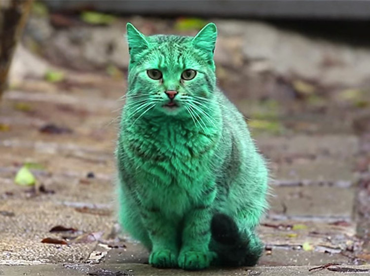
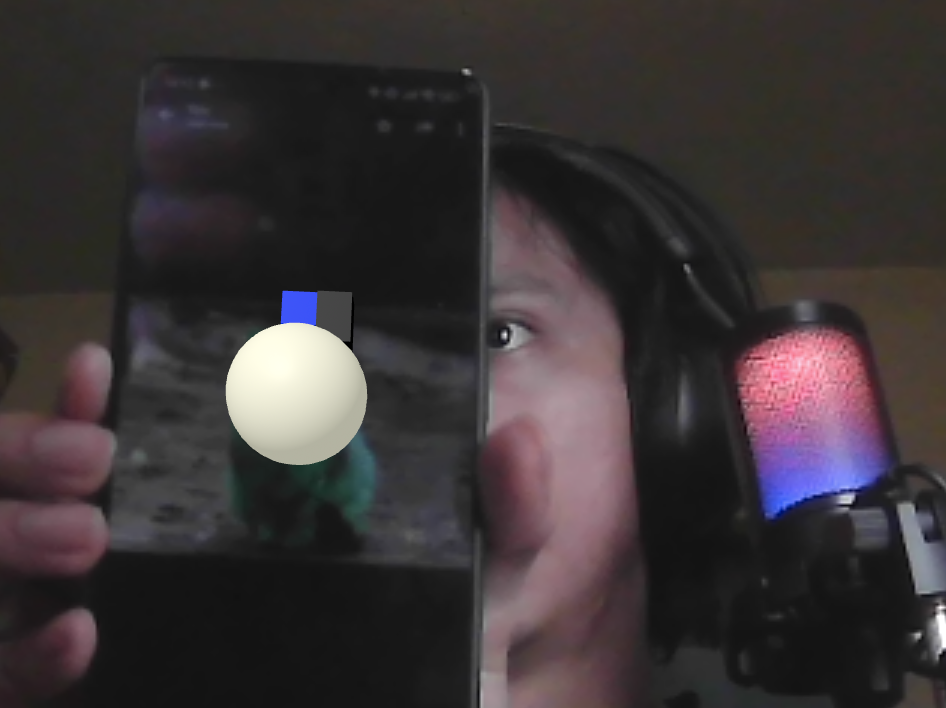

# Hoja de trabajo #2

# HTML
```html
<!DOCTYPE html>
<html lang="es">
<head>
    <meta charset="UTF-8">
    <meta name="viewport" content="width=device-width, initial-scale=1.0">
    <title>HT2 - Edwin Sandoval López - MindAR</title>
    <script src="https://aframe.io/releases/1.5.0/aframe.min.js"></script>
    <script src="https://cdn.jsdelivr.net/npm/mind-ar@1.2.5/dist/mindar-image-aframe.prod.js"></script>
</head>
<body style="margin: 0px; overflow: hidden;">
    <a-scene mindar-image="imageTargetSrc: ./assets/targets.mind;" vr-mode-ui="enabled: false" device-orientation-permission-ui="enabled: false">
        <a-camera position="0 0 0" look-controls="enabled: false"></a-camera>
        <a-entity mindar-image-target="targetIndex: 0">
            <a-sphere position="0 0.1 0" radius="0.2" color="#F5F5DC"></a-sphere>
            <a-box position="0 0.34 0" material="color: blue;" depth="0.1" width="0.1" height="0.1"></a-box>
            <a-box position="0.1 0.32 0" material="color: black;" depth="0.1" width="0.1" height="0.15"></a-box>
        </a-entity>
    </a-scene>
</body>
</html>
```

# Imagen de Prueba




# Imagen Compilada


# Funcionamiento

Usando la libreria Mindar con acceso a la camára, genera un objecto 3d imagenes previamente compialdas.


