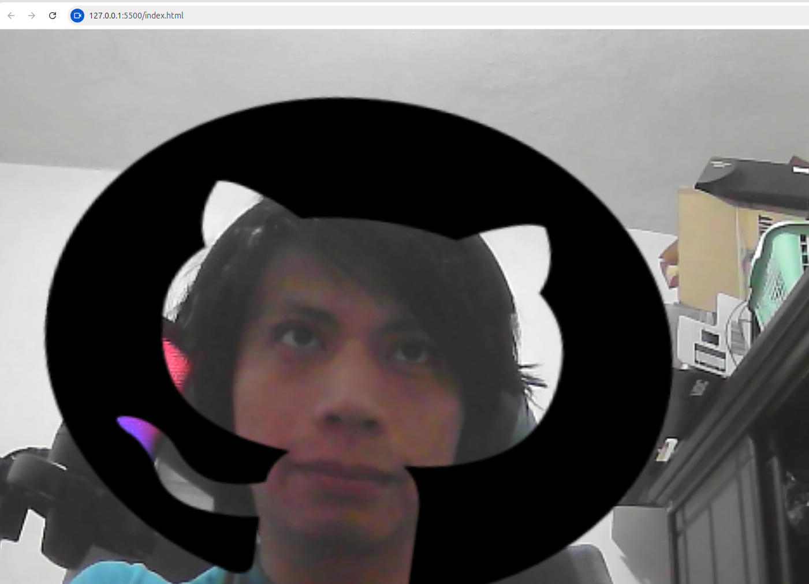

# 📌 Introducción

Este proyecto utiliza la biblioteca **MindAR** para implementar un filtro de realidad aumentada (AR) que se superpone sobre el rostro del usuario. El objetivo principal es demostrar cómo integrar un filtro 2D en un entorno web utilizando únicamente HTML, sin necesidad de instalar librerías adicionales.

---

# 🖼️ Imagen de Referencia

Para las pruebas, se utiliza la siguiente imagen de referencia:

Esta imagen permite verificar el correcto funcionamiento del filtro AR, asegurando que el objeto 2D se alinee adecuadamente con el rostro.

---

# 🎭 Filtro Aplicado

El filtro consiste en una imagen de unos cuernos, diseñada para colocarse sobre la cabeza del usuario. La imagen utilizada es:

Este filtro se carga como una textura sobre un objeto 2D y se posiciona dinámicamente sobre la cara detectada en la escena AR.

---

# ⚙️ Funcionamiento

La implementación es sencilla y no requiere instalación de librerías externas, ya que **MindAR** se importa directamente en el HTML. El sistema utiliza la cámara para detectar el rostro en la imagen de prueba y posiciona sobre él el filtro 2D.

El flujo general es el siguiente:

1. Configuración de la escena AR con MindAR y Three.js.
2. Carga del filtro como textura y asignación a un objeto 2D.
3. Posicionamiento dinámico del filtro sobre la cara detectada.
4. Renderizado continuo para mantener el filtro alineado en tiempo real.

A continuación, se muestra una captura del filtro en funcionamiento:

